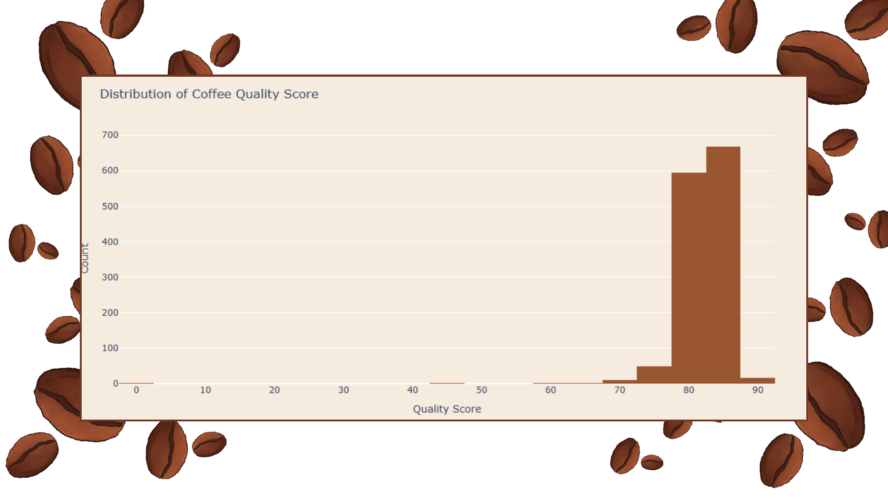
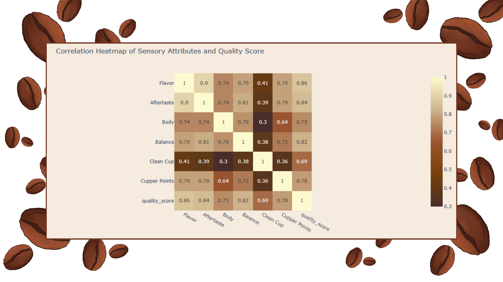
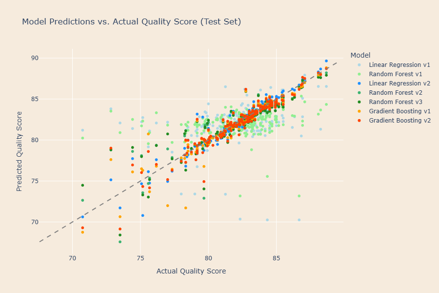
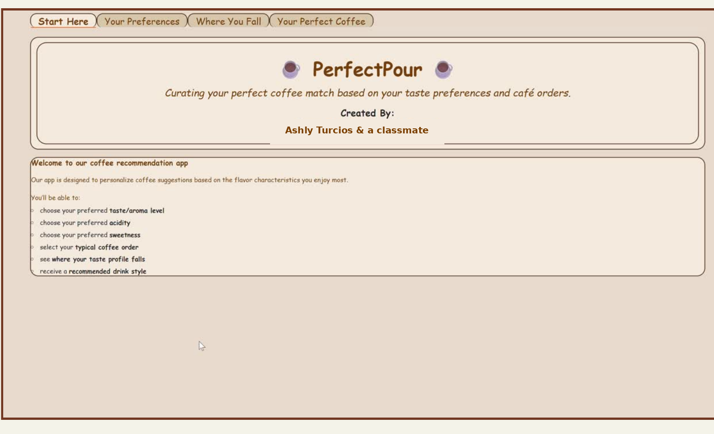

# ☕ PerfectPour: Predicting Coffee Quality & Personalizing Recommendations

**A predictive analytics case study — from a raw quality dataset to a working recommendation app.**

*By Ashly Turcios Sierra, developed with a classmate*

---

## The Problem

Specialty coffee consumption is growing roughly 7.5% a year, yet choosing a coffee is still mostly guesswork. Flavor preference is subjective, menus are overwhelming, and most customers default to reordering the same "safe" drink instead of discovering something they'd actually enjoy more.

We set out to answer: **can data on a coffee's origin, quality metrics, and flavor characteristics predict its quality — and can that same data power personalized drink recommendations?**

## The Data

We combined the Arabica and Robusta datasets from the [Coffee Quality Institute's Q Coffee System](https://www.coffeeinstitute.org/) (via the [Coffee Quality Database](https://github.com/jldbc/coffee-quality-database)) into a single working set:

- **1,340 combined observations**, 43 variables
- **Production features**: species, country of origin, region, variety, processing method, altitude, moisture, defect counts
- **Sensory features**: flavor, aroma, aftertaste, body, balance, clean cup, cupper points



Most coffees in the dataset cluster tightly in the specialty-grade range (roughly 75-90), which is itself a modeling challenge — there's not a lot of variance to predict against.

## Cleaning & Prep

Real-world data problems, not textbook ones:
- Altitude values ranged from 0 to 190,137 meters — clearly full of data entry errors, requiring outlier capping before it was usable
- Mixed units (bag weights, altitude ranges) needed standardizing into a single `altitude_mean_meters` field
- Heavy geographic skew toward Mexico, Colombia, and Guatemala, which we flagged as a generalizability limitation
- Text fields needed whitespace/format cleanup before they were usable as categorical variables

## The Modeling Journey (and where it went wrong first)

The most useful part of this project wasn't the final model — it was *why* the early ones failed.

| Model | Validation RMSE | Validation R² | Test RMSE | Test R² |
|---|---|---|---|---|
| Linear Regression (production features only) | 3.17 | -1.03 | 3.14 | -0.36 |
| Random Forest (production features only) | 2.57 | -0.34 | 2.78 | -0.06 |
| Linear Regression v2 (+ sensory features) | 1.06 | 0.77 | 0.82 | 0.91 |
| Random Forest v2 (+ sensory features) | 0.76 | 0.88 | 1.14 | 0.82 |
| Random Forest v3 (more regularized) | 0.73 | 0.89 | 1.18 | 0.81 |
| Gradient Boosting | 1.05 | 0.78 | 1.02 | 0.86 |
| **Gradient Boosting v2 (final)** | **0.82** | **0.86** | **0.95** | **0.88** |

**What we learned at each step:**
- Using only production/origin variables (altitude, processing, country) produced negative R² — these features describe a coffee's *potential*, not its actual taste in the cup.
- Adding sensory attributes (flavor, aftertaste, body, balance) improved performance dramatically — a coffee's quality score is fundamentally about the tasting experience, not where or how it was grown.
- Random Forest looked strong on validation but widened its validation-test gap as we regularized it further — a sign it wasn't the right model family for this problem, not a tuning failure.
- **Gradient Boosting v2**, with a lower learning rate, shallower trees, and subsampling, gave us the best balance of accuracy and generalization: test RMSE of 0.95 and R² of 0.88.

Sensory attributes (especially flavor and aftertaste) consistently dominated feature importance; geographic variables contributed comparatively little once taste data was in the model.





The predictions-vs-actual plot makes the improvement visually obvious — later model versions (darker orange/blue) hug the diagonal far more tightly than the early Linear Regression baseline (light blue).

## From Prediction to Product: PerfectPour

A quality score alone doesn't help a customer standing at a counter. So we built **PerfectPour**, an interactive app that turns the model into something usable:


<br><sub>🔗 <a href="#">Try the live demo</a> — link goes here once deployed</sub>

1. **Your Preferences** — user rates their taste/aroma preference, acidity tolerance, sweetness level, and typical café order
2. **Where You Fall** — visualizes their taste profile against common drink styles (e.g., how they compare on an acidity-vs-sweetness map)
3. **Your Perfect Coffee** — a K-Nearest Neighbors similarity search returns the closest-matching coffees, blended with predicted quality, and translates that into a recommended drink style with a plain-language "why we picked it"

The recommendation logic weights taste similarity and predicted quality (70/30) so a recommendation is never just "the closest match" — it also has to be genuinely good coffee.

We also mocked up branded versions of the interface (Starbucks, Dunkin', Peet's) to show how this could plug into an existing café's ordering flow rather than being a standalone tool.

## Key Takeaways

- **Feature choice mattered more than model choice.** The single biggest jump in performance came from adding sensory data, not from switching algorithms.
- **Overfitting isn't solved by "more regularization."** Our Random Forest got *worse* on the validation-test gap as we tightened it — Gradient Boosting's built-in shrinkage and subsampling handled the bias-variance tradeoff more gracefully for this dataset.
- **A model is not a product.** The KNN recommender and Gradio interface were what made this usable by an actual person, not just an analyst.

## What's Next

- Address the geographic skew — the model currently underrepresents coffee-growing regions outside Latin America
- Expand the recommender beyond the current preference dimensions (e.g., roast level, brew method)
- Deploy PerfectPour as a live demo rather than a local notebook app

## Tech Stack

`Python` · `pandas` / `numpy` · `scikit-learn` (Linear Regression, Random Forest, Gradient Boosting, KNN) · `Plotly` / `Matplotlib` / `Seaborn` · `Gradio`

## Repo Structure

```
├── README.md
├── requirements.txt
├── notebooks/
│   └── perfectpour_analysis.ipynb   # full analysis + modeling
├── app/
│   ├── app.py                        # standalone PerfectPour Gradio app
│   ├── requirements.txt
│   └── README.md                     # Hugging Face Spaces config
├── data/
│   └── README.md                     # data source + how to reproduce
└── images/                           # charts used in this README
```

## Running It Yourself

**Analysis notebook:**
```bash
pip install -r requirements.txt
# download arabica_ratings_raw.csv and robusta_ratings_raw.csv into data/ (see data/README.md)
jupyter notebook notebooks/perfectpour_analysis.ipynb
```

**PerfectPour app, locally:**
```bash
cd app
pip install -r requirements.txt
python app.py
```

---

*This project began as a final project for a predictive analytics course and was rebuilt here as a portfolio case study.*
